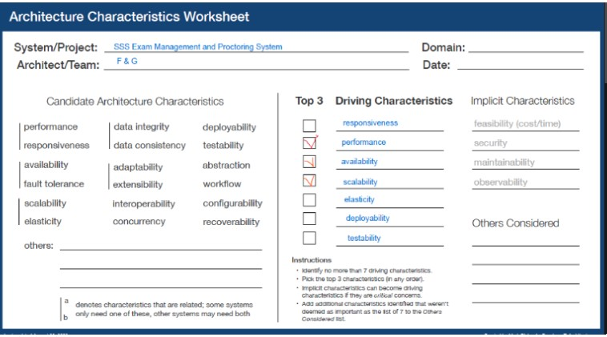
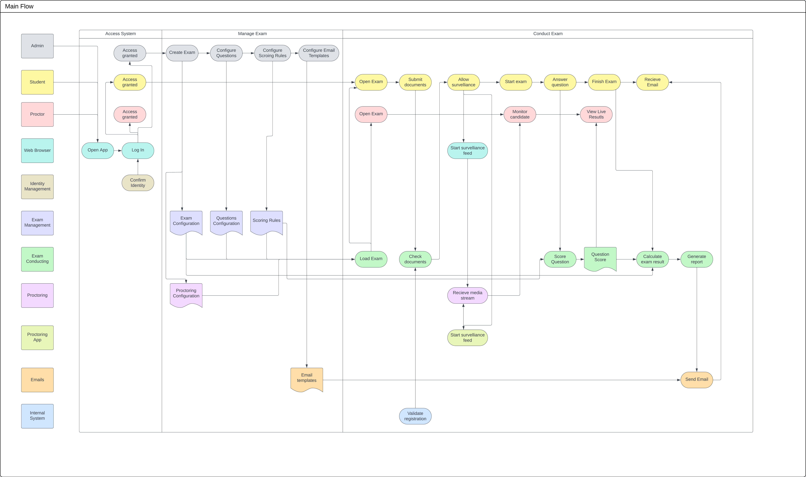
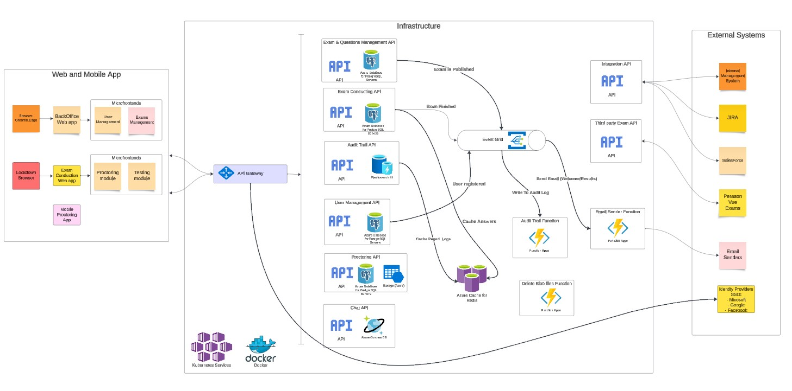

## Background
In response to the evolving demands of modern professionals, FLEX EXAMS will enable candidates to conveniently undertake examinations from the comfort of their homes, tailored to their schedules. 
Candidates can opt for comprehensive training through third-party providers or pursue self-study methodologies. 
Committed to delivering a seamless and dependable examination experience, FLEX EXAMS is a solution that not only encompasses essential functionalities but also offers responsive support, minimal downtime, and expedited update deployments.

## Requirements
### Functional
#### Exam Management
-	Ability to administer and maintain questions library, exam templates and email templates
-	Create, schedule and monitor exams, define multiple settings for them such as categories, navigation rules and scoring rules
#### User Management
-	Ability to administer users, roles and permissions
#### Questions Management
-	Ability to choose predefined question types, but also be flexible for easy upgrade with new types
-	Support rich content such as pictures, audio, video
#### Audit Trail
-	Logging the actions that users perform
-	Search and filter the audit trails list
#### Proctoring
-	Ability to register participants and verify identity via ID documents
-	Ability to follow the participants actions through video and photos during the exam

### Non-Functional
#### Scalability & Elasticity
-	Support up to 1000 users at a time and handle increased load at peak times
#### Availability
-	The system should be highly available with near zero downtime
#### Security
-	Available only for authenticated and authorized users
-	Provide confidentiality and integrity of data
#### Usability
-	The system should be localized in multiple languages
-	The system should be easy to use and have intuitive UI compliant to W3C standards
-	Page load time should be up to 5 seconds, ideally under 2 seconds

## Proposed Solution
### Architecture Characteristics and Style 

While analysing the requirements, we identified the following architecture characteristics as driving ones in order to assess what architecture would be the most appropriate

| Characteristic | Description                                                                                                                                                                                                                             |
|---------------|-----------------------------------------------------------------------------------------------------------------------------------------------------------------------------------------------------------------------------------------|
| Availability      | Relates to the amount of uptime of a system. Uptime is greatly dependent on physical machine uptime, but it is also significantly impacted by software architecture. Based on the requirement, it should be highly available with near zero downtime. |
| Scalability | Relates to the system's capacity to remain responsive and performant as the number of users and requests increase over time. The system should support up to 1000 consecutive users.|
| Performance     | Relates to the amount of time it takes for the system to process a business request. |

Based on these characteristics, we propose an event-driven microservice architecture. 

### Functional Viewpoint
In order to understand the user flows in the system and have better representation of them, we've done an event storming exercise and defined the actors, the actions they take (commands) and the events that should happen in the system. For better visibility, we split it into different contexts. For more details, visit the section below:
- ### [Event Storming](event_storming/README.md)

#### Main Flow
Based on the functional requirements, and the outcome of the event storming exercise, we identified some main flows that the system should support and domains that will responsible for them. There are many additional flows, but all are connected to the main ones.

We detected three main flows that would take place in the system: Access the system -> Manage exam -> Conduct an exam

#### Access the system
All users that access the system will go through authentication steps either via an external identity provider or an internal identity verification.
Once they sign in they can access the parts of the system they are authorized for.

#### Manage Exam
Once an admin user has signed in, they will create an exam, add questions to it, configure the scoring rules and configure email templates that will be sent for the exam results. They can enable proctoring as well if necessary. Storing and handling the configuration will be responsibility of the exam management and proctoring domains respectively. Sending emails will be responsibility of the Emails domain.

#### Conduct Exam
When a Student or Proctor access an exam, it will be loaded with the configuration made in the previous flow. The data will be gathered by the Exam Conducting context. We can view the conducting of the exam from two perspectives moving onwards:
#### Student:
- The student will submit the necessary documents for identification, which will be validated depending on the data in the internal system. 
- Once the documents are checked, if a proctoring is required for the exam, video and audio feed will be started for monitoring purposes.
- As the student answers the questions, the scores will be calculated along the way in the Exam Conducting context.
- When the exam is finished, the overall result will be calculated in the Exam Conducting context and pass the report to the emailing domain.
- An email with the results will be sent to the student.
#### Proctor:
- During the exam the proctor will be able to monitor the candidates via live feed that will be handled by the Proctoring domain.
- The proctor can follow statistics about the exam. 

### Architecture Decision Records
- ### [ADR1 - Event-Driven Microservice Architecture with Microsoft Azure](decision-records/adr1-use-event-driven-microservice-architecture-with-azure.md)
- ### [ADR2 - Azure Event Grid for Event-Driven Architecture](decision-records/adr2-use-azure-event-grid.md)
- ### [ADR3 - Implement Single Sign-On (SSO) for Authentication](decision-records/adr3-implement-sso.md)
- ### [ADR4 - Implement Azure Redis for Caching](decision-records/adr4-use-redis-cache.md)
- ### [ADR5 - Azure Database for PostgreSQL over Azure SQL Database](decision-records/adr5-use-postgre-sql.md)
- ### [ADR6 - Elasticsearch as the Database for the Audit Log API](decision-records/adr6-use-elasticsearch.md)

### Architectural Diagram

The final high overview architectural diagram will look like this:

