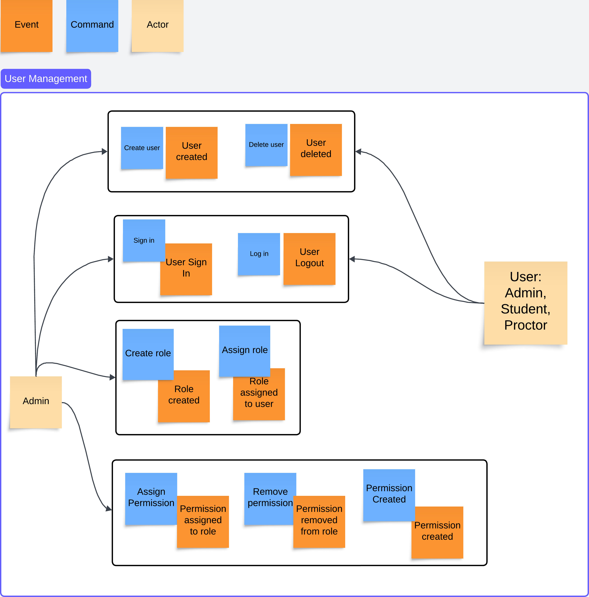
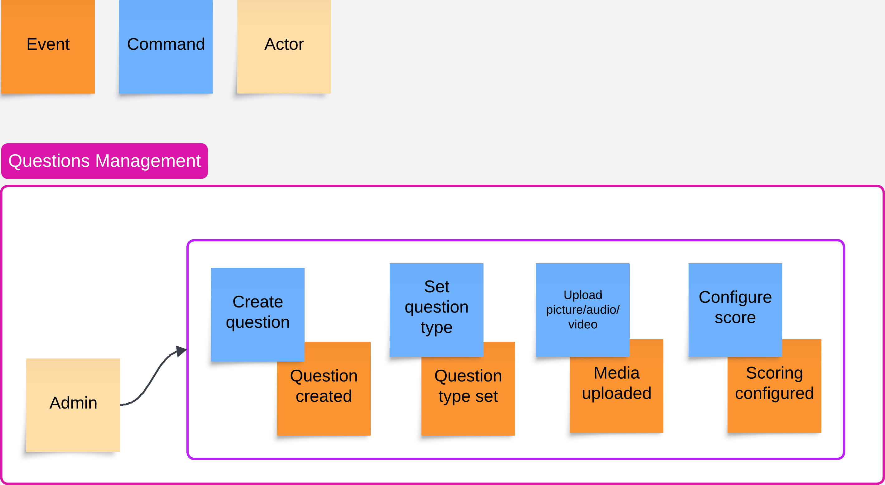
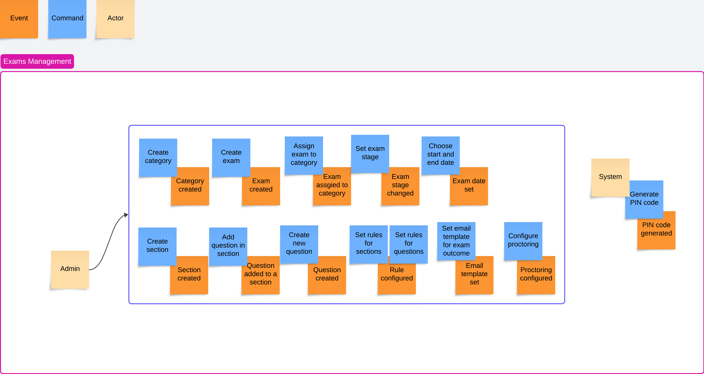
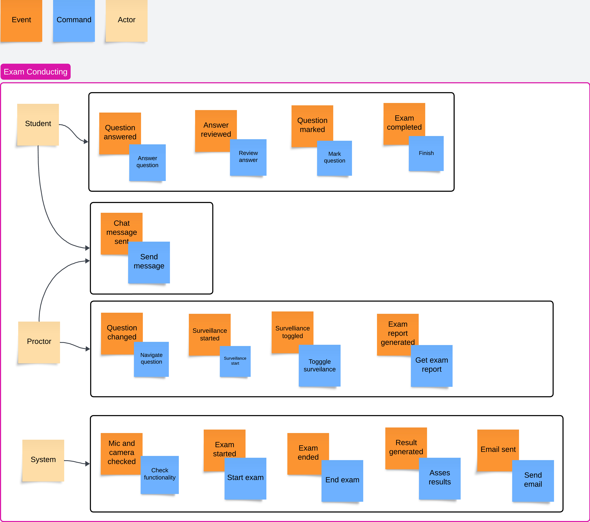
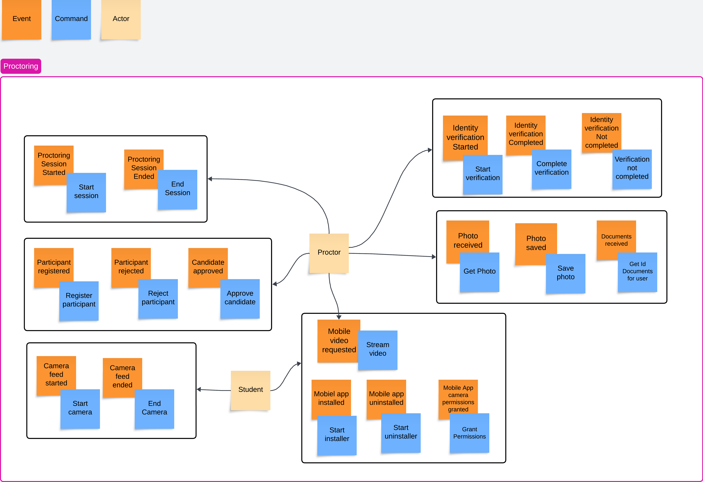
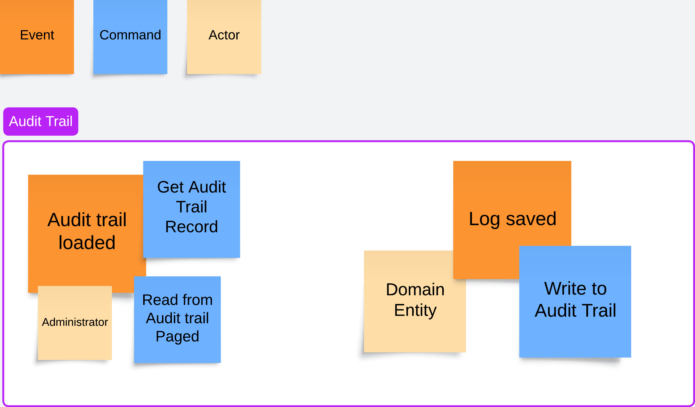

## Event Storming
We used the event storming technique to quickly explore the domains and understand the processes that would later help us define the flows in the system and model the architecture. We split it into the following contexts, for better visibility and focus:

### User Management

We detected two main groups of users that would perform actions related to user management: 
- Admin group that would be able to manage other users, create roles and permissions and assign them to other users
- User group that depending on the permissions can either manage other users (different types of admins) or just log into the system and perform actions in other contexts of the system (students, proctors)

### Questions Management

Based on the permissions set in the User Management context, admins can log into the system and create questions, set the type, manage media for rich question types and configure the scoring for each of the questions

### Exams Management

Users that have permissions to manage exams can log into the system and create an exam, add different sections with questions, set navigation rules etc. We separated the generation of PIN code for accessing an exam as an action that will be performed by the system itself.

### Exam Conducting

In the context of conducting an exam, there could be three groups of actors:
- Student that will answer questions, review them and complete the exam.
- Proctor that can navigate through the questions and see the answers, perform a surveillance of the exam and see a report for it. Proctors and student can chat during the exam.
- The system can automatically start and end the exam, assess the questions and send email to the student with the results.

### Proctoring

If a proctoring is enabled for an exam:
- Proctors will review the participants for the exam and register them, manage the surveillance session through the web browser or the proctoring app and take photos of the participants.
- Students could open the proctoring app and set it for surveillance and/or enable the webcam and mic for proctoring via web browser.

### Audit Trail

Each of the domains in the system will be logging the actions that take place in their context. Admins can have a view of the audit trail and search through the actions that took place.